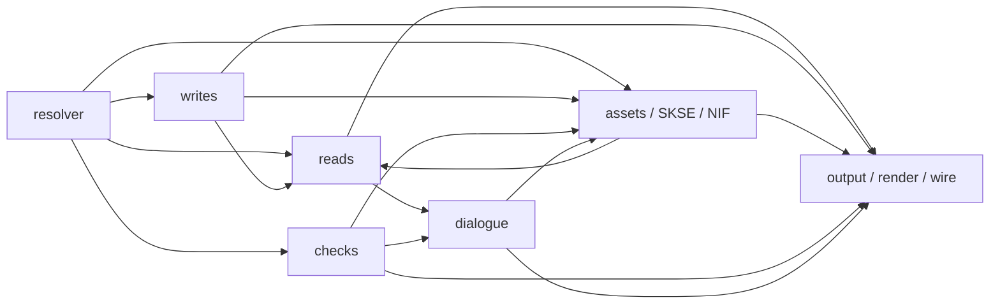

# docs/

- **`architecture/`**: one short note per subsystem, saying what it is and the contracts that hold it together. Written when a subsystem is touched and something about it is not obvious from the code.
- **`decisions/`**: short numbered records of architectural decisions, one per file: context, decision, consequences. A PR that changes the architecture adds one. A change of mind is a new record that names the one it replaces.

New here? Read [README.md](../README.md), then [CLAUDE.md](../CLAUDE.md), then the note for the subsystem you are entering.

## The pieces, and who calls whom

## The architecture notes

Grouped to match the "Where things live" table in [CLAUDE.md](../CLAUDE.md), so the code map and the doc map are the same map. The rule: a note is grouped under the `CLAUDE.md` row holding most of the files in its `covers:` list, not by its subject; a note that also covers a file in another row gets a one-line cross-reference under that row. A new note starts from [`architecture/TEMPLATE.md`](architecture/TEMPLATE.md) and adds its line here.

### The MCP server and tool surface

| Note | What it covers |
|---|---|
| [`architecture/nexus.md`](architecture/nexus.md) | Keyless read-only access to the Nexus Mods v2 GraphQL API: search, mod detail, file-level update checks, MD5 identify, and the raw-query backstop. |

### Instance, status, config

| Note | What it covers |
|---|---|
| [`architecture/mo2-instance.md`](architecture/mo2-instance.md) | houseCARL reads a live MO2 portable instance off disk, never through the USVFS, so the instance ini and the three profile files are the only standalone source of truth. |

### Assets, SKSE, NIF, SkyPatcher

| Note | What it covers |
|---|---|
| [`architecture/assets.md`](architecture/assets.md) | Which copy of a file the game uses: loose beats BSA-packed, the overwrite-then-mods-then-Data walk, and the archive tie-break. |
| [`architecture/skse-layer.md`](architecture/skse-layer.md) | What an SKSE DLL declares and the static-load rule: everything in the layer is what a file declares, never what a DLL does. |
| [`architecture/skypatcher-layer.md`](architecture/skypatcher-layer.md) | SkyPatcher edits records from INI files at load, so a plugin read alone does not say what the game sees; houseCARL reads that layer in four tiers. |
| [`architecture/nif.md`](architecture/nif.md) | Reading mesh values and the two write gates: `NifService` is pure format logic, and the service layer resolves the winning bytes. |

### Output, render, wire, schema, shim

| Note | What it covers |
|---|---|
| [`architecture/output-and-artifacts.md`](architecture/output-and-artifacts.md) | Everything houseCARL writes lands in a houseCARL-owned MO2 mod folder, a folder the caller named outright, or a result artifact file. |
| [`architecture/render-budget.md`](architecture/render-budget.md) | Two budgets share the word: `max_chars`, how wide a response may be, and the render bound, how long a call may spend rendering before it refuses up front. |
| [`architecture/json-wire.md`](architecture/json-wire.md) | The json transport's own contracts: what a machine-readable document may say and how it may say it. |
| [`architecture/tool-schema-publication.md`](architecture/tool-schema-publication.md) | The SDK generates each tool's `inputSchema` from its C# signature; three things it cannot get right are corrected at registration, and a fourth pass cuts the result to a nesting depth. |
| [`architecture/tool-call-argument-shim.md`](architecture/tool-call-argument-shim.md) | A call-tool filter that runs before the SDK binds a call's JSON arguments, so a malformed argument shape is an answer a caller can self-correct from instead of an opaque dead end. |

### Checks and the rulebook

| Note | What it covers |
|---|---|
| [`architecture/corpus-rulebook.md`](architecture/corpus-rulebook.md) | The write surface's pre-flight: every write is validated against the generated schema before any Mutagen mutation, and the gate can never disagree with apply. |

### Writes

No note of its own yet. [`architecture/corpus-rulebook.md`](architecture/corpus-rulebook.md) covers `src/housecarl-core/WriteEngine.cs` — half of its two-file `covers:` list, not most of it, so it stays above and is cross-referenced here.

### Dialogue

| Note | What it covers |
|---|---|
| [`architecture/dialogue.md`](architecture/dialogue.md) | The implementation side of dialogue: the merged INFO order, the fold, CK parity, and what a clean pass means. |

### Records and owned children

| Note | What it covers |
|---|---|
| [`architecture/records-owned-child-declarers.md`](architecture/records-owned-child-declarers.md) | A child-bearing field is declared per plugin and assembled by the game from every declarer, so a read states two quantities: the field's own value, and the additive union beside it. |
| [`architecture/select-and-walk.md`](architecture/select-and-walk.md) | How a selection is made and followed: the `where=` value predicate, the `*parent` containment step and its index, the closure walk and its ordered source universe, the whole-order reverse index, the deep comparison behind the tree form, and the localized-strings classifier. |
| [`architecture/read-engine.md`](architecture/read-engine.md) | The read path from a `records` call to a rendered body: what winner resolution the read engine does and does not do, the tree and field folds, and the reverse walk. |

### Tests and fixtures

| Note | What it covers |
|---|---|
| [`architecture/check-family-tests.md`](architecture/check-family-tests.md) | The errors, scripts and dialogue families of `housecarl_check` are asserted from two driving lanes, and which lane a fact uses is a decision, not a convenience. |
| [`architecture/test-project-fixtures.md`](architecture/test-project-fixtures.md) | Two pieces of test machinery, the Papyrus `.pex` world and the file-lock harness, plus the tests that prove each is what it claims to be. |

## Older notes outside `architecture/`

| Note | What it covers |
|---|---|
| [`dialogue.md`](dialogue.md) | The modder-facing page: what decides which line plays, and where a line lands — quest priority, intra-topic order, and the bookkeeping `housecarl_create` fills for you. |
| [`facegen.md`](facegen.md) | Dark faces: the desync between the winning `NPC_` record and the winning baked face files, what each class means, and what fixes each. |

## Decision records

| Record | What it decided |
|---|---|
| [`decisions/0001-terse-comments-public-knowledge-home.md`](decisions/0001-terse-comments-public-knowledge-home.md) | Comments stay terse; engineering knowledge moves to a public `docs/` home. Superseded 2026-09-04; kept because other records and code cite it. |
| [`decisions/0002-published-tool-schemas-carry-no-ref.md`](decisions/0002-published-tool-schemas-carry-no-ref.md) | Published tool schemas carry no `$ref`. |
| [`decisions/0003-guards-move-to-a-standard-test-project.md`](decisions/0003-guards-move-to-a-standard-test-project.md) | Guards move to a standard test project, behind a residue countdown. Superseded 2026-09-04. |
| [`decisions/0004-tool-names-are-compile-time-constants.md`](decisions/0004-tool-names-are-compile-time-constants.md) | Tool names are compile-time constants, never spelled by hand. |
| [`decisions/0005-the-1x-tools-are-deleted-not-deprecated.md`](decisions/0005-the-1x-tools-are-deleted-not-deprecated.md) | The 1.x tools are deleted, not deprecated. |
